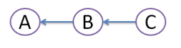
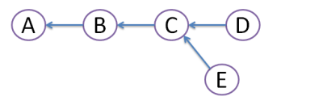
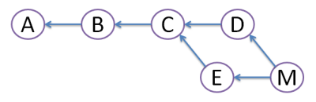
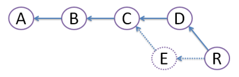

## 其他知识

#### 1.git的merge和rebase有什么区别？

假设我们原来有3个提交,A, B, C

 

后来有两个开发者分别创建了2次提交D和E:

 

merge

 

D和E的提交都依然存在，但是我们创建一个merge提交M继承了D和E的区别。

rebase

 

我们创建了提交R，这个文件实际上合上书提交M是一样的。

如果你希望你新提交的feature分支永远是最新的，那么你应该使用git rebase；如果你希望的你的日志顺序一直是保持正确的顺序，你应该使用git merge.

####  数据库中如何使用NULL

判断为空的时候，is NULL

判断不为空的时候，IS NoT NULL 或者NoT(name IS NULL)

# 第二范式

第二范式是在第一范式的基础上消除了非主属性对键的部分函数依赖

# having和where

having和where都是用来筛选的，having是筛选组，而where是筛选记录的

# 数据库设计模式

* 概念模式是数据库系统中全局数据逻辑结构的描述，是全体用户公共数据视图。
* 外模式也称为子模式或用户模式，它是用户的数据视图，给出了每个用户的局部数据描述。
* 内模式又称为物理模式，给出了数据库物理存储结构和物理存取方法。

 # 索引

* 对于字符串的like操作%出现在前面的，都需要全表扫描，用不上索引。
* 索引可以包含一个、两个或者更多列，两个及以上的索引成为符合索引。

# 存储过程

* 存储过程是一个预编译的代码块，执行效率比较高
* 一个存储过程代替大量的T-SQL语句，可以降低网络通信量，提高通信效率
* 可以一定程度上确保数据安全

# drop,delete,truncate的使用场景

* 不需要一张表的时候，用drop
* 要删除部分数据行时候，用delete，并且带上where子句
* 保留表并且删除所有数据的时候使用truncate